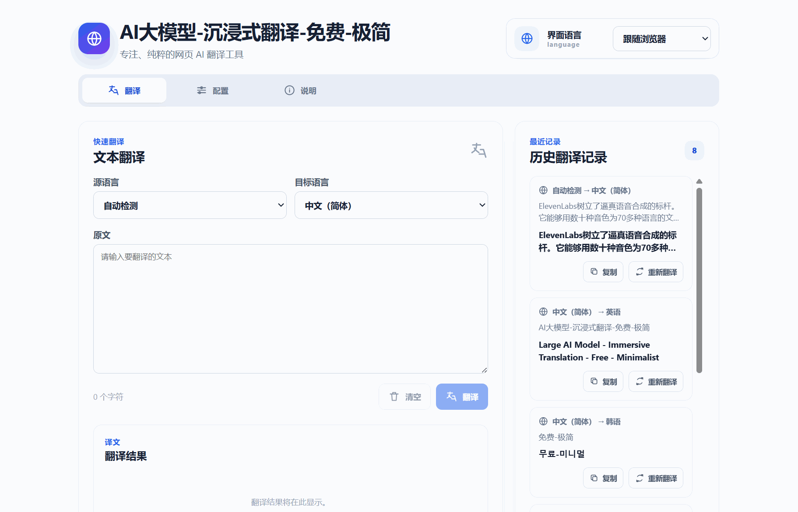

# AI-Powered Immersive Translator

[简体中文](README.md) · [English](README.en.md)

A lightweight Manifest V3 translation extension for Chrome and Microsoft Edge. It uses your own OpenAI-compatible API to translate text selections, standalone text, and complete webpages without interrupting your browsing flow.



## Features

- **Standalone text translation**: The extension opens on the Translate tab and provides source and target language selectors, character count, copy, clear, and retranslate actions.
- **Translation history**: The 30 most recent successful translations are stored locally with their original text, translated text, source language, and target language.
- **Selection translation**: Select text on a webpage and translate it directly from the context menu.
- **Full-page translation**: Extract visible page content while skipping code, form controls, buttons, and hidden text.
- **Two display modes**: Replace the original text or preserve it in a bilingual comparison layout.
- **Dynamic content support**: Continue watching for lazy-loaded or newly inserted content and translate it as it appears.
- **Adaptive batching and concurrency**: Use up to 10 nodes in the first batch for fast feedback, then up to 25 nodes or 6,000 characters; concurrency adapts between five and eight requests and only recoverable failures are retried.
- **Thinking disabled**: Every translation request sends `thinking: { type: "disabled" }` to avoid spending time generating reasoning for translation work.
- **Large-page support**: Allow up to 200 model requests per page task. Overflow is reported explicitly instead of being silently discarded.
- **Multilingual interface**: Includes 17 interface and target languages, with automatic source-language detection.
- **Local-first design**: No product backend, advertising, or telemetry. Profiles and translation history remain in local browser storage.

## Supported languages

Simplified Chinese, Traditional Chinese, English, Japanese, Korean, French, German, Spanish, Portuguese, Russian, Arabic, Italian, Thai, Vietnamese, Indonesian, Hindi, and Turkish.

## Installation

### Build from source

Install Node.js and npm, then run:

```powershell
npm install
npm run build
```

The production extension is generated in `dist`.

### Load the extension

1. Open `chrome://extensions` or `edge://extensions`.
2. Enable Developer mode.
3. Select **Load unpacked**.
4. Choose the generated `dist` directory.

After rebuilding, reload the extension from the extensions page and refresh any webpages that were already open.

## Usage

### 1. Configure a model

Click the extension icon, open the Settings tab, and provide:

- Profile name
- OpenAI-compatible API Base URL, such as `https://api.example.com/v1`
- API key
- Model name
- Source and target languages
- Translation mode: replace the original or show a bilingual comparison

The Base URL must use HTTPS. HTTP is allowed only for `localhost`, `127.0.0.1`, and `[::1]`. Test the connection before saving and activating a profile.

The service must support the OpenAI-compatible `POST /chat/completions` request format.

### 2. Translate standalone text

The Translate tab is selected when the extension opens. Enter text, choose the languages, and click Translate. The button is enabled only when a complete model profile has been configured and activated.

Results can be copied or translated again. Successful translations appear in the history panel, which retains the latest 30 entries.

### 3. Translate webpages

- **Selection translation**: Select text and choose **Translate selected text** from the context menu.
- **Full-page translation**: Right-click the page and choose **Translate this page**.
- **Task controls**: Use the in-page panel to follow progress, cancel work, retry failed items, or restore the original page.

Browser-restricted pages cannot run extension content scripts. Examples include `chrome://`, `edge://`, other extension pages, and the Chrome Web Store.

## Privacy

- Page text and manually entered text are sent to the active API only after an explicit translation action.
- The project has no relay server or product backend.
- API keys, profiles, and the latest 30 successful Translate-tab records are stored in `chrome.storage.local` and are not browser-synchronized.
- Webpage originals, webpage translations, and complete API request bodies are not persisted.
- No telemetry, analytics, or usage statistics are collected.

See [PRIVACY.md](PRIVACY.md) for details.

## Development

### Commands

```powershell
# Generate and validate localization resources
npm run generate:i18n

# Run the complete test suite
npm test

# Run tests in watch mode
npm run test:watch

# Type-check and create a production build
npm run build

# Build, validate, and create the store-ready ZIP
npm run package:release
```

Both `npm test` and `npm run build` automatically generate and validate localization resources.

The release package is written to `release/llm-web-translator-<version>.zip` by default. The script checks that `package.json` and `public/manifest.json` use the same version, verifies that `manifest.json` is at the ZIP root, and prints a SHA-256 checksum. If a package for the same version already exists, run `npm run package:release -- -Force` to replace it.

### Project structure

```text
src/
├─ background.ts                 # Background tasks, context menus, concurrency, and retries
├─ content.ts                    # Page extraction, translated content, and dynamic monitoring
├─ options.ts                    # Translate, settings, history, and about views
└─ shared/
   ├─ api.ts                     # OpenAI-compatible API client and output cleanup
   ├─ batching.ts                # Page-node batching and request limits
   ├─ i18n.ts                    # Base locale catalog
   ├─ i18n-locales.ts            # Additional locale catalog
   ├─ storage.ts                 # Local browser settings storage
   └─ translation-history.ts     # Latest 30 translation records
public/
├─ _locales/                     # Generated browser-native localization resources
└─ manifest.json                 # Manifest V3 configuration
docs/assets/demo.gif             # README project demo
scripts/                         # Localization, icons, build validation, and release packaging
```

## Localization

Maintain localized copy only in:

- `src/shared/i18n.ts` for English, Simplified Chinese, Traditional Chinese, and Japanese.
- `src/shared/i18n-locales.ts` for the other 13 languages.

Do not edit `src/generated/content-locales.ts` or `public/_locales` directly. Running `npm run generate:i18n` regenerates them from the canonical catalog. `public/_locales` remains responsible for browser-native strings such as the extension name, description, toolbar tooltip, and context-menu labels.
